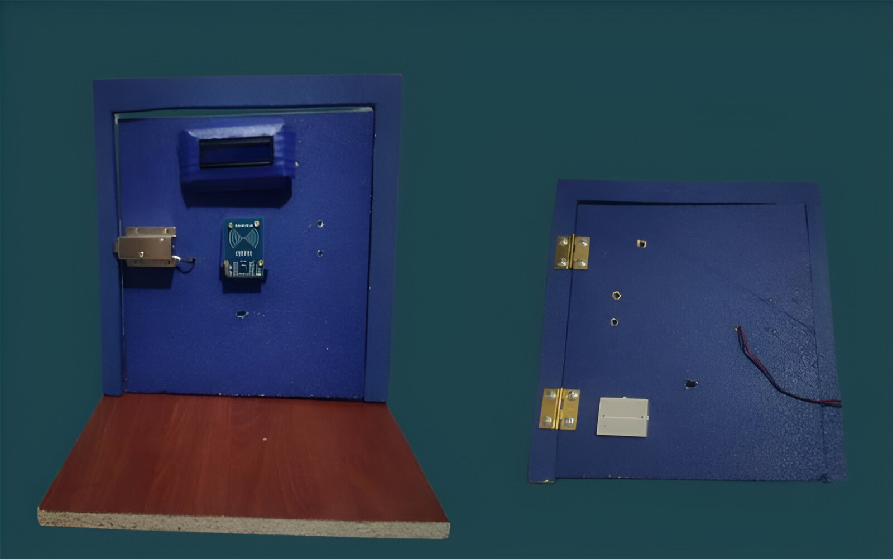
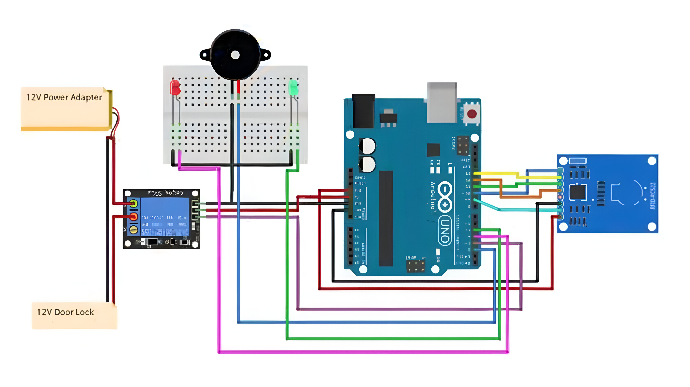

# Proyecto: Cerradura eléctrica con RFID
 
## Avances del proyecto
Proyecto desarrollado para la materia de Internet de las Cosas.
 
### Integrantes
- Marianny Batista
- Rodrigo Améstica
- Krishna Pavié
 
### Docente
Ignacio Pérez
 
### Asignatura
IOT
 
## Elementos de los artefactos del circuito
En esta sección, se detallan los componentes seleccionados para la construcción de la cerradura electrónica, especificando brevemente su función en el circuito.
 
- **Cable USB-B a USB**: Permite la conexión de la placa Arduino UNO a una computadora para la transferencia de datos y programación, así como para suministrar energía durante las pruebas del circuito.
- **Arduino UNO**: Microcontrolador principal del circuito, encargado de gestionar las entradas y salidas y ejecutar el código de control.
- **Llaveros y tarjetas RFID**: Dispositivos que contienen un identificador único, usados para autorizar o denegar el acceso a través del sensor RFID.
- **Relé**: Actúa como un interruptor controlado electrónicamente, permitiendo el paso de corriente para activar la cerradura.
- **Pantalla LCD**: Dispositivo de salida que muestra mensajes o el estado del sistema al usuario.
- **Luces LED verde y roja**: Indican el estado de acceso; verde para acceso autorizado y rojo para acceso denegado.
- **Buzzer**: Emite un sonido para alertar al usuario sobre el estado del acceso (aprobado o denegado).
- **Jumpers**: Cables de conexión utilizados para establecer las conexiones necesarias entre los componentes en el circuito.
- **Placa sensora RFID**: Dispositivo que lee los identificadores de los llaveros RFID y transmite la información al Arduino.
- **Bisagra**: Componente mecánico que facilita la apertura y cierre de la estructura controlada por la cerradura.
 
## Avances en estructura física
Hasta el momento, se ha completado la implementación de la pantalla LCD, la bisagra y el módulo RFID, que ha sido soldado con pines para asegurar su funcionalidad. El proyecto aún se encuentra en desarrollo, y los próximos avances se abordarán en clase.

## Avances en estructura de cableado

